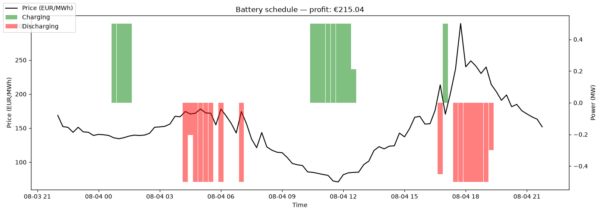

# Electricity Price Pipeline

Automated daily fetch of European day-ahead electricity prices across multiple
bidding zones (DE-LU, AT, FR, NL, BE), via energy-charts.info. Runs daily via
GitHub Actions, validates data quality, and commits results as Parquet files.

Includes a battery storage optimizer that uses linear programming to find the
profit-maximizing charge/discharge schedule against real historical prices.

## Structure
- `src/fetch.py` — pulls day-ahead prices from the API across 5 European bidding zones, with retry/backoff for rate limits
- `src/transform.py` — DST-safe timestamp handling
- `src/validate.py` — data quality checks (row count, price range, timestamp integrity)
- `src/optimize.py` — battery charge/discharge optimization via `scipy.optimize.linprog`
- `data/processed/` — daily Parquet files, one per country per day
- `.github/workflows/fetch_prices.yml` — daily automation (14:00 UTC + backup run)

## Setup
python -m venv .venv
.venv\Scripts\Activate.ps1
pip install -r requirements.txt
python src/fetch.py # fetch today's prices for all countries
python src/fetch.py 2026-08-03 # backfill a specific date
python src/optimize.py # run battery optimization on a chosen day

## Example output

Battery schedule for Aug 4, 2026 (1 MWh capacity, 0.5 MW max power):

Optimizer correctly identifies price troughs to charge and price peaks to
discharge, yielding €215 theoretical profit for the day.