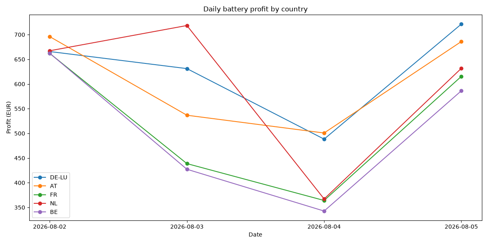
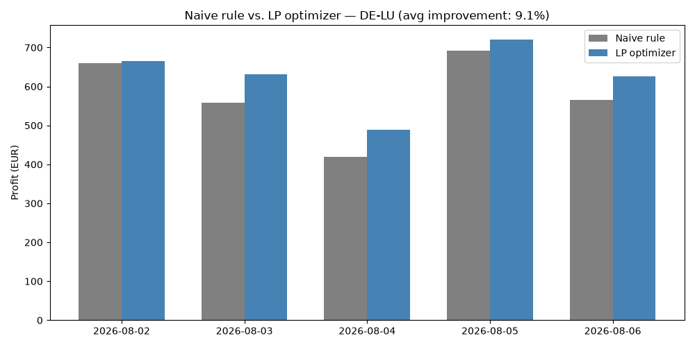

# Electricity Price Pipeline

Automated daily fetch of European day-ahead electricity prices across multiple
bidding zones (DE-LU, AT, FR, NL, BE), via energy-charts.info. Runs daily via
GitHub Actions, validates data quality, and commits results as Parquet files.

Includes a battery storage optimizer that uses linear programming to find the
profit-maximizing charge/discharge schedule against real historical prices,
backtested against a naive rule-based baseline. Core optimization logic is
covered by unit tests that run automatically via CI on every push.

## Structure
- `src/fetch.py` — pulls day-ahead prices from the API across 5 European bidding zones, with retry/backoff for rate limits
- `src/transform.py` — DST-safe timestamp handling
- `src/validate.py` — data quality checks (row count, price range, timestamp integrity)
- `src/optimize.py` — battery charge/discharge optimization via `scipy.optimize.linprog`
- `src/baseline.py` — naive rule-based strategy, used as a comparison baseline
- `src/backtest.py` — runs the optimizer across all accumulated days, per country, and compares results
- `tests/test_optimize.py` — unit tests for the optimizer's core logic
- `data/processed/` — daily Parquet files, one per country per day
- `.github/workflows/fetch_prices.yml` — daily data fetch automation (14:00 UTC + backup run)
- `.github/workflows/run_tests.yml` — runs the test suite on every push

## Setup
```
python -m venv .venv
.venv\Scripts\Activate.ps1
pip install -r requirements.txt

python src/fetch.py                 # fetch today's prices for all countries
python src/fetch.py 2026-08-03      # backfill a specific date
python src/optimize.py              # run battery optimization on a chosen day
python src/backtest.py              # run backtest across all countries and days
python src/baseline.py              # compare against naive strategy
pytest tests/ -v                    # run the test suite
```

## Example output

Battery schedule for Aug 4, 2026, using specs matching a single Tesla Megapack 2
unit (3.9 MWh capacity, 1 MW power, ~93.7% round-trip efficiency). The battery
starts empty and is constrained to end the day with at least as much charge as
it started with.


Optimizer correctly identifies price troughs to charge and price peaks to
discharge, yielding €488 theoretical profit for the day.

**Limitations of this example:**
- Assumes perfect foresight of the full day's prices. A realistic deployment
  would need to re-optimize on a rolling basis, using only prices known at
  each point in time (day-ahead auctions close ~1 day before delivery).
- Ignores battery degradation costs, which would reduce real-world profitability
  over many charge/discharge cycles.
- A production strategy would be backtested across many days and market
  conditions before being trusted.

## Multi-country comparison

Running the same backtest across all 5 tracked bidding zones (Aug 2-6, 2026):



| Country | Avg. daily profit | Total (5 days) |
|---------|-------------------|-----------------|
| DE-LU   | €626.64            | €3,133.21       |
| NL      | €607.44            | €3,037.19       |
| FR      | €554.95            | €2,774.76       |
| AT      | €570.25            | €2,851.25       |
| BE      | €532.92            | €2,664.58       |

DE-LU shows the highest average arbitrage profit, plausibly reflecting Germany's
high renewable energy share (wind/solar), which tends to produce more volatile
day-ahead prices — and more volatility means more opportunity for battery arbitrage.
This is a small, early sample (5 days); a longer backtest would be needed to
confirm this pattern holds over different seasons and weather conditions. As
more days accumulate via the automated daily pipeline, this backtest will
naturally cover more market conditions and become more statistically meaningful.

## Optimization vs. naive strategy

How much better is the LP optimizer than a simple rule-based approach
("charge when price is in the bottom 25%, discharge when price is in the
top 25%")? Comparing both strategies on DE-LU across the same 5 days:



The LP optimizer beats the naive rule on every single day tested, averaging
**9.1% higher profit**. The gap is largest on more volatile days, since a
fixed-threshold rule can't adapt to the specific shape of each day's price
curve the way a full-day optimization can.

## Pipeline reliability

As of this writing, the automated daily fetch has run successfully via GitHub
Actions' schedule for 3+ consecutive days without manual intervention, in
addition to on-demand manual runs used for testing and backfilling. A separate
CI workflow runs the unit test suite on every push to catch regressions early.

## Possible next steps

- Rolling (day-by-day) backtest that only uses prices known at each point in
  time, rather than optimizing full days in isolation
- Battery degradation modeling for more realistic long-run profitability
- Extend the naive-vs-optimizer comparison across more countries and a longer
  time window as more data accumulates