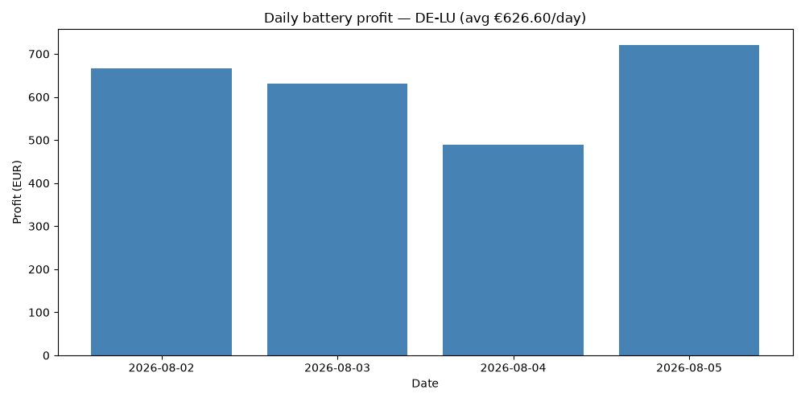

# Electricity Price Pipeline

Automated daily fetch of European day-ahead electricity prices across multiple
bidding zones (DE-LU, AT, FR, NL, BE), via energy-charts.info. Runs daily via
GitHub Actions, validates data quality, and commits results as Parquet files.

Includes a battery storage optimizer that uses linear programming to find the
profit-maximizing charge/discharge schedule against real historical prices.

## Structure
- `src/fetch.py` — pulls day-ahead prices from the API across 5 European bidding zones, with retry/backoff for rate limits
- `src/transform.py` — DST-safe timestamp handling
- `src/validate.py` — data quality checks (row count, price range, timestamp integrity)
- `src/optimize.py` — battery charge/discharge optimization via `scipy.optimize.linprog`
- `data/processed/` — daily Parquet files, one per country per day
- `.github/workflows/fetch_prices.yml` — daily automation (14:00 UTC + backup run)

## Setup
python -m venv .venv
.venv\Scripts\Activate.ps1
pip install -r requirements.txt
python src/fetch.py # fetch today's prices for all countries
python src/fetch.py 2026-08-03 # backfill a specific date
python src/optimize.py # run battery optimization on a chosen day

## Example output

Battery schedule for Aug 4, 2026, using specs matching a single Tesla Megapack 2
unit (3.9 MWh capacity, 1 MW power, ~93.7% round-trip efficiency). The battery
starts empty and is constrained to end the day with at least as much charge as
it started with, so the optimizer has to genuinely earn any energy it discharges
rather than selling off a free starting reserve.

Optimizer correctly identifies price troughs to charge and price peaks to
discharge, yielding €488 theoretical profit for the day.

**Limitations of this example:**
- Assumes perfect foresight of the full day's prices. A realistic deployment
  would need to re-optimize on a rolling basis, using only prices known at
  each point in time (day-ahead auctions close ~1 day before delivery).
- Ignores battery degradation costs, which would reduce real-world profitability
  over many charge/discharge cycles.
- Single bidding zone, single day — a production strategy would be backtested
  across many days and market conditions before being trusted.

## Backtest across multiple days

Running the optimizer independently on each of the 4 days collected so far
(Aug 2-5, 2026), using the same Tesla Megapack 2 specs:

As more days
accumulate via the automated pipeline, this backtest will cover more market
conditions and give a more statistically meaningful picture.
